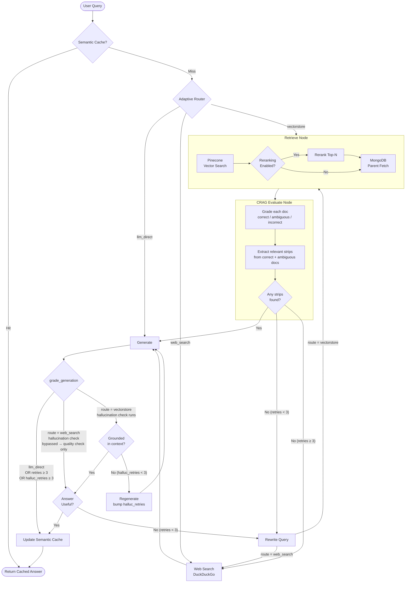

# Agentic RAG Pipeline

A robust, stateful Retrieval-Augmented Generation (RAG) system synthesizing **Adaptive RAG**, **Corrective RAG (CRAG)**, and **Self-RAG** into a dynamic cyclical pipeline. Built using LangGraph, Pinecone, MongoDB, and Groq.

## Architecture

The system intelligently routes, validates, and refines queries using a rigorous, graph-based state machine that dynamically recovers from hallucinations and poor retrievals.



## framework choice & why

- **langgraph**: used as an orchestration engine for the agentic rag pipeline. 
- **groq**: offers free tier for llms.
- **duckduckgo search**: free search api. acts as a fallback.
- **mongodb + pinecone**: hybrid data layer. pinecone is fast for vector search. mongodb holds the heavy parent chunks with relevant metadata.

## chunking strategy & why

i used a **parent-child chunking** method.
- **the process**: split docs into big parent chunks. then split those into small child chunks. pinecone only stores the small child chunks. if pinecone finds a match, it gives me the `parent_id`, used this to fetch the huge parent text from mongodb.
- **why?**: this gives me the best of both worlds. tiny chunks give exact search hits. big chunks give the llm rich context to answer correctly.

## design trade-offs

1. **latency vs. accuracy**
running multiple checks adds latency. but it reduces hallucinations.

2. **deterministic loop boundaries**
self-rag loops can run forever. it might keep searching for missing facts. i added a hard limit. the system tries max 3 times.


## evaluation (ragas)

because i don't have access to an explicitly labeled ground-truth dataset, i built an automated evaluation pipeline using the **ragas** framework. it focuses on two critical reference-free metrics to grade the language model:
- **faithfulness**: checks if the llm hallucinated facts outside the source documents.
- **answer relevancy**: checks if the generated answer directly addresses the user's intent.

### test cases & results

i evaluated 3 distinct scenarios representing the pipeline's core branches:

1. **vectorstore route**: 
   - *"What are two specific complementary graphs constructured during the dual graph construction phase?"*
     - **faithfulness**: `1.00`, **answer relevancy**: `0.98`
   - *"what are the two multimodal document question answering (DQA) benchmarks used to test the model performance?"*
     - **faithfulness**: `1.00`, **answer relevancy**: `1.00`

2. **web search fallback**:
   - *"What is the current Delhi Temperature?"*
     - **faithfulness**: `1.00`, **answer relevancy**: `0.98`
   - *"Has the corresponding author of RAG-Anything, Chao Huang from the University of Hong Kong, announced any new multimodal framework updates or papers in the past week?"*
     - **faithfulness**: `0.33`, **answer relevancy**: `0.81`

3. **direct llm route**: 
   - *"Can you explain the general concept of 'Retrieval-Augmented Generation' and why it is necessary for LLM?"*
     - **faithfulness**: `0.00`, **answer relevancy**: `0.75`
   - *"write a Python function using numpy to calculate the cosine similarity between two 1D array embeddings, which is a common metric used in semantic matching"*
     - **faithfulness**: `0.25`, **answer relevancy**: `0.89`

> **note**: you can reproduce these metrics by running the `notebooks/ragas_evaluation.ipynb` file.

## future improvements

based on the evaluation results above, here are a few areas for future iteration:

1. **web search depth**: while simple web queries perform perfectly (1.00 faithfulness), complex web searches (like tracking recent author publications) see a drop in faithfulness (0.33). upgrading from the basic duckduckgo snippet search to a deeper web scraper or a dedicated search api (e.g. tavily) could provide richer context.
2. **evaluation metrics routing**: the `direct_llm` route naturally scores very low on *faithfulness* (0.00 - 0.25) because it bypasses the retriever and relies on parametric knowledge, resulting in an empty context array. the evaluation pipeline should be adjusted to use different metrics (like answer correctness) for non-retrieval routes to prevent skewed results.
3. **advanced chunking**: explore adaptive or semantic chunking methods. although the parent-child chunking works exceptionally well for the vectorstore queries (1.00 faithfulness), semantic chunking could further optimize token usage and help pinpoint exact reasoning steps in dense research papers.

## Quick Start Demo

Run the fully unified Agentic pipeline interactively from your terminal to see the routing branches natively executed:

```bash
# 1. Start the Virtual Environment
.venv\Scripts\activate

# 2. Run the Demo CLI
python main.py --query "Tell me about RAG-Anything's architecture"
```

For Jupyter fans, refer to `notebooks/demo_agentic_rag.ipynb` to view step-by-step stream traces of the Graph navigating edge constraints.